# M324 DevOps - Architecture Ref Card 03

- [M324 DevOps - Architecture Ref Card 03](#m324-devops---architecture-ref-card-03)
  - [About this project](#about-this-project)
  - [Setting up the Repository](#setting-up-the-repository)
    - [Variables](#variables)
      - [Repository secrets](#repository-secrets)
      - [Repository variables](#repository-variables)
    - [Environments](#environments)
    - [Branch protection](#branch-protection)
  - [Setting up a GitHub runner](#setting-up-a-github-runner)
    - [Creating a systemd service](#creating-a-systemd-service)
  - [Deploying the application on AWS](#deploying-the-application-on-aws)
    - [Creating a relational database with RDS](#creating-a-relational-database-with-rds)
    - [Creating an ECS cluster](#creating-an-ecs-cluster)
    - [Creating an ECS task definition](#creating-an-ecs-task-definition)
    - [Creating an ECS service](#creating-an-ecs-service)
  - [The pipeline](#the-pipeline)
    - [Actions](#actions)
      - [Setup ECR Action](#setup-ecr-action)
    - [Workflows](#workflows)
      - [CI/CD workflow](#cicd-workflow)
  - [Public runner pricing](#public-runner-pricing)

## About this project

The Architecture Ref Card 03 application is from M347. It loads jokes from a database and displays it on an HTML page with Thymeleaf. The application is using the spring boot framework with different layers like controller, service, repository, and model. The application is using the H2 database to store the jokes. The application is using the spring boot framework with different layers like controller, service, repository, and model. The application is using the H2 database to store the jokes.

## Setting up the Repository

### Variables

#### Repository secrets

To use the AWS CLI, you will need to have the tokens for AWS stored as a secret.

- `AWS_ACCESS_KEY_ID`
- `AWS_SECRET_ACCESS_KEY`
- `AWS_SESSION_TOKEN`

You can find the AWS credentials in the learner lab here:

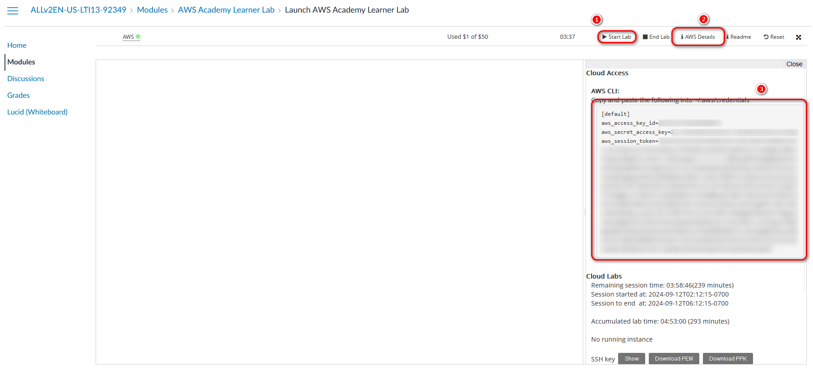

> [!IMPORTANT]
> The credentials will change every time you start the lab. So you will need to update the credentials in the GitHub secrets.

#### Repository variables

To manage the versioning, we will use the `VERSION` variable. This variable will be used to tag the docker image and the GitHub release. We have to increment this variable every time the production deployment ran successfully.

I also added `DEPLOY_TO_AWS` for the pipeline, so that I can shut down and delete the ECS and RDS on AWS to save costs. If this variable is set to `false`, the pipeline will not push the docker image to the ECR and will not deploy the image to the ECS. But it will still build the image and push to the GitHub Container Registry if it is running on the `main` branch.

### Environments

Environments allow you to have environment specific variables for a job. You can define the environments in the GitHub repository settings under "Environments".

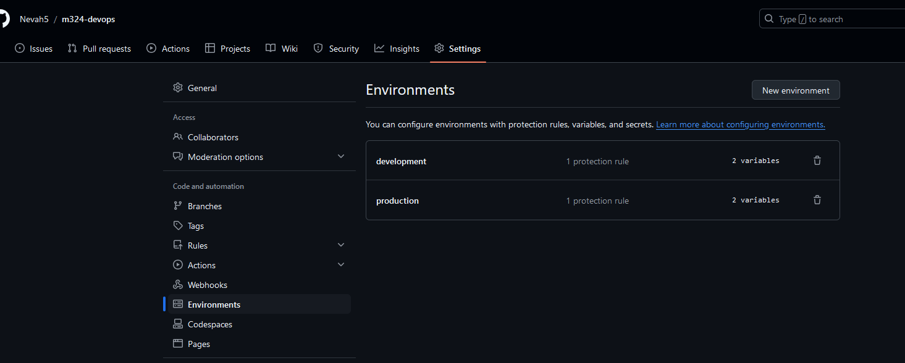

Because we are building a docker image, we have to store that somewhere. You generally do that in a container registry. For this project, I need to deploy it to ghcr.io (GitHub Container Registry). Because I also want to deploy this application on AWS, I additionally push the image into an ECR (Elastic Container Registry). I created two ECRs. One for the development environment with mutable tags, so tags can be overwritten (snapshot registry). And another one for the production environment, where it is critical to not overwrite older versions to allow a rollback in an emergency (release registry). You can find the needed variables here:

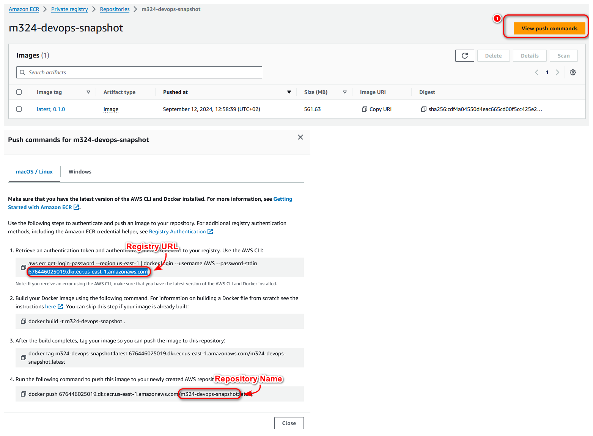

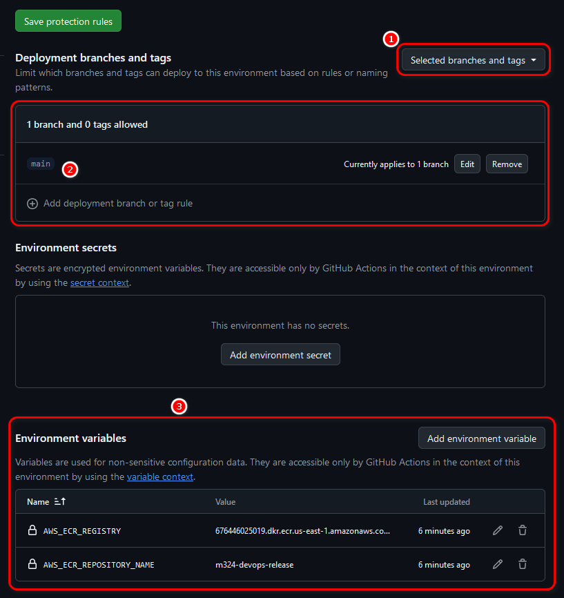

It is also a good practice to define a deployment protection. As you can see in the screenshot under "Deployment branches and tags", I restricted the production environment to run on the `main` branch only.

In my case I setup the variables for the `production` and `development` environment like following:

| Variable                   | `production`                                                                          | `development`                                |
| -------------------------- | ------------------------------------------------------------------------------------- | -------------------------------------------- |
| `AWS_ECR_REGISTRY`         | 676446025019.dkr.ecr.us-east-1.amazonaws.com                                          | 676446025019.dkr.ecr.us-east-1.amazonaws.com |
| `AWS_ECR_REPOSITORY_NAME`  | m324-devops-release                                                                   | m324-devops-snapshot                         |
| `AWS_ECS_CLUSTER`          | m324-devops-cluster                                                                   | m324-devops-cluster                          |
| `AWS_ECS_SERVICE`          | m324-refcard-prod                                                                     | m324-refcard-devt                            |
| `AWS_TASK_DEFINITION_NAME` | m324-refcard03-prod                                                                   | m324-refcard03-devt                          |
| `DB_URL`                   | jdbc:mariadb://m324-refcard03-db.cpaysuk8s81l.us-east-1.rds.amazonaws.com:3306/jokedb | <-   (the same)                              |
| `DB_USERNAME`              | jokedbuser                                                                            | jokedbuser                                   |


Then also for only the production environment the following `Environment Secret`:

- `DB_PASSWORD`

I haven't set any secrets, because we will define them in AWS for each environment that we deploy to.

### Branch protection

Setting up a branch protection, so that you need a pull request for the default branch and cannot delete the develop branch is a good practice.

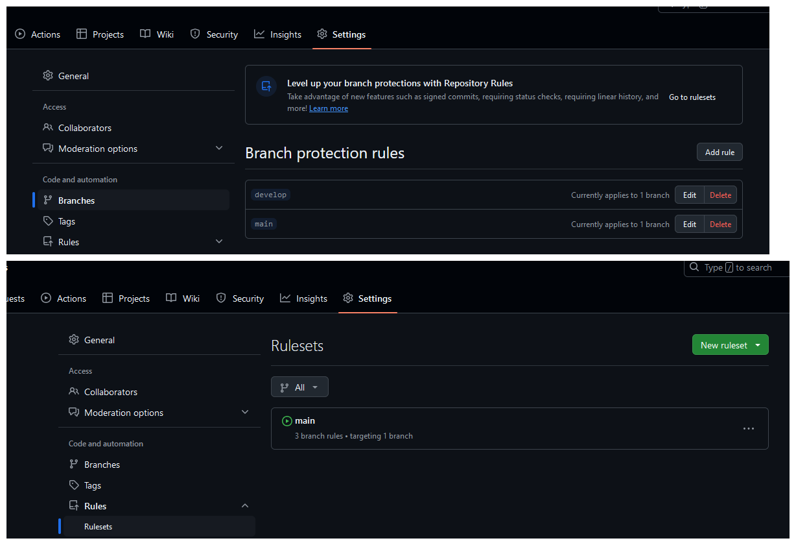

## Setting up a GitHub runner

Under "Settings > Actions > Runners" you can find the link to "[Learn more about self-hosted runners](https://docs.github.com/en/actions/hosting-your-own-runners/managing-self-hosted-runners/about-self-hosted-runners)".

In my case I will be setting up a runner on repository level.

To start, I went to `Settings > Actions > Runners` and clicked on `New self-hosted runner`.

Then I setup a new EC2 instance on AWS and logged in.

```sh
ssh -i m324-key.pem ec2-user@<ip>
```

Then I started the installation process.

```sh
# Create a folder
$ mkdir actions-runner && cd actions-runner
# Download the latest runner package
$ curl -o actions-runner-linux-x64-2.319.1.tar.gz -L https://github.com/actions/runner/releases/download/v2.319.1/actions-runner-linux-x64-2.319.1.tar.gz
# Optional: Validate the hash
$ echo "3f6efb7488a183e291fc2c62876e14c9ee732864173734facc85a1bfb1744464  actions-runner-linux-x64-2.319.1.tar.gz" | shasum -a 256 -c
# Extract the installer
$ tar xzf ./actions-runner-linux-x64-2.319.1.tar.gz
```

So far so good.

```sh
# Create the runner and start the configuration experience
$ ./config.sh --url https://github.com/Nevah5/m324-devops --token ASNJAFY6N3D4CFLO6GLUSTTG4LWPQ
```

Then after running this command, I got the following error:

```log
Libicu's dependencies is missing for Dotnet Core 6.0
Execute sudo ./bin/installdependencies.sh to install any missing Dotnet Core 6.0 dependencies.
```

So I ran `./bin/installdependencies.sh` and got another error:

```log
[ec2-user@ip-172-31-23-23 actions-runner]$ sudo ./bin/installdependencies.sh
--------OS Information--------
NAME="Amazon Linux"
VERSION="2023"
ID="amzn"
ID_LIKE="fedora"
VERSION_ID="2023"
PLATFORM_ID="platform:al2023"
PRETTY_NAME="Amazon Linux 2023.5.20240903"
ANSI_COLOR="0;33"
CPE_NAME="cpe:2.3:o:amazon:amazon_linux:2023"
HOME_URL="https://aws.amazon.com/linux/amazon-linux-2023/"
DOCUMENTATION_URL="https://docs.aws.amazon.com/linux/"
SUPPORT_URL="https://aws.amazon.com/premiumsupport/"
BUG_REPORT_URL="https://github.com/amazonlinux/amazon-linux-2023"
VENDOR_NAME="AWS"
VENDOR_URL="https://aws.amazon.com/"
SUPPORT_END="2028-03-15"
------------------------------
"fedora"
Can't detect current OS type based on /etc/os-release.
Can't install dotnet core dependencies.
You can manually install all required dependencies based on following documentation
https://docs.microsoft.com/en-us/dotnet/core/linux-prerequisites?tabs=netcore2x
```

After inspecting the installation script, I extracted and ran those commands:

```sh
sudo yum install -y openssl krb5-libs zlib
sudo dnf install -y lttng-ust openssl-libs krb5-libs zlib libicu
```

Then the `./config.sh` script worked and I was able to register the runner.

Finally only `./run.sh` left. And to run it in the background: `./run.sh &`.

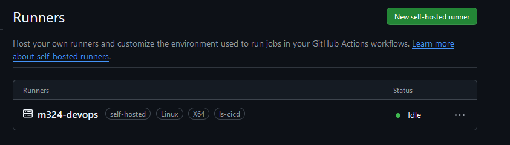

To use the runner in a workflow, I can add the following:

```yaml
jobs:
  example:
    runs-on: self-hosted
```

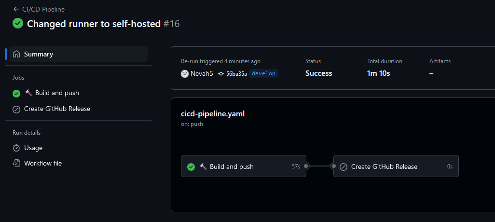

### Creating a systemd service

To manage the runner more easily and to automatically start it on boot, I created a systemd service in `/etc/systemd/system/actions-runner.service`.

```sh
[Unit]
Description=GitHub Actions Runner
After=network.target

[Service]
Type=simple
User=ec2-user
WorkingDirectory=/home/ec2-user/actions-runner
ExecStart=/home/ec2-user/actions-runner/run.sh > /home/ec2-user/actions-runner/logs/logs.txt 2> /home/ec2-user/actions-runner/logs/error.txt
Restart=always

[Install]
WantedBy=multi-user.target
```

Then I started the service:

```sh
sudo systemctl start actions-runner.service
# to check if the service is running
sudo systemctl status actions-runner.service
```

## Deploying the application on AWS

### Creating a relational database with RDS

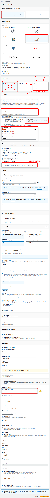

After creating, you can find the url of the database here:

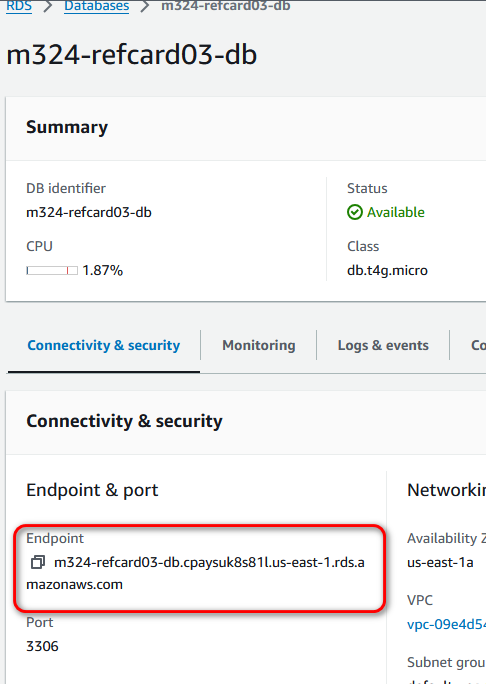

Store this endpoint like this in the GitHub environment variable `DB_URL`:

```txt
jdbc:mariadb://<RDS_ENDPOINT_URL>/jokedb
```

### Creating an ECS cluster

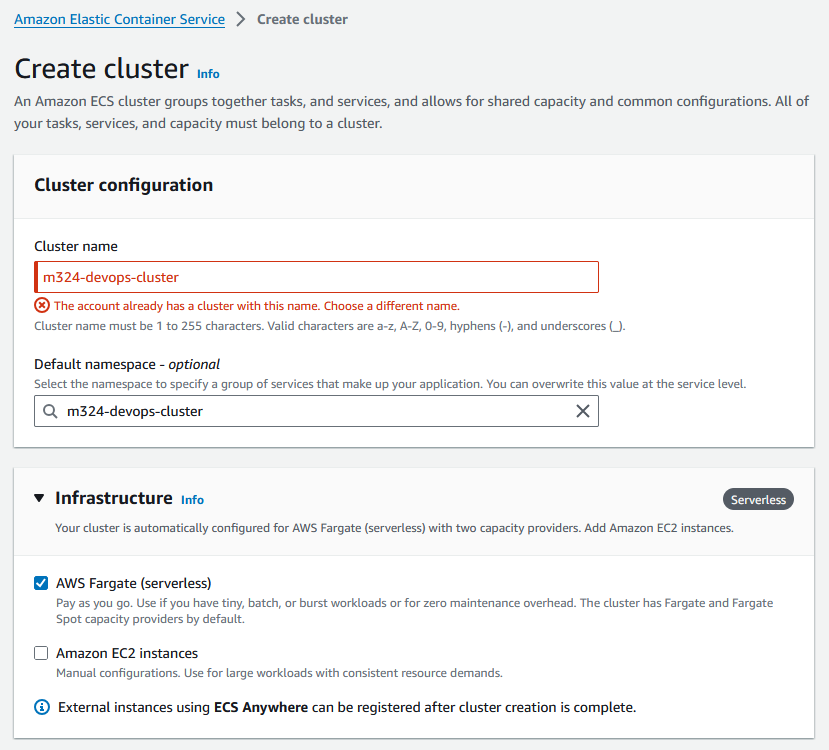

After creation, you should be able to find the cluster in the list.

### Creating an ECS task definition

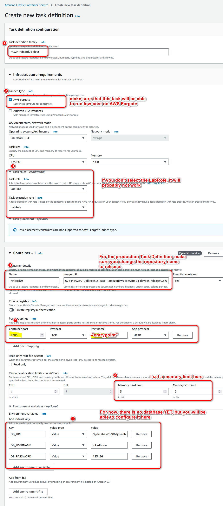

For the environment variables, put in the details you already know. For the production environment, there is a JSON file for the task definition, located [here](./.github/aws/task-definition-prod.json). The pipeline will overwrite wrongly configured settings. Make sure tough, that the development task definition is correct.

### Creating an ECS service

After creating the task definition, you can create a service for the task.

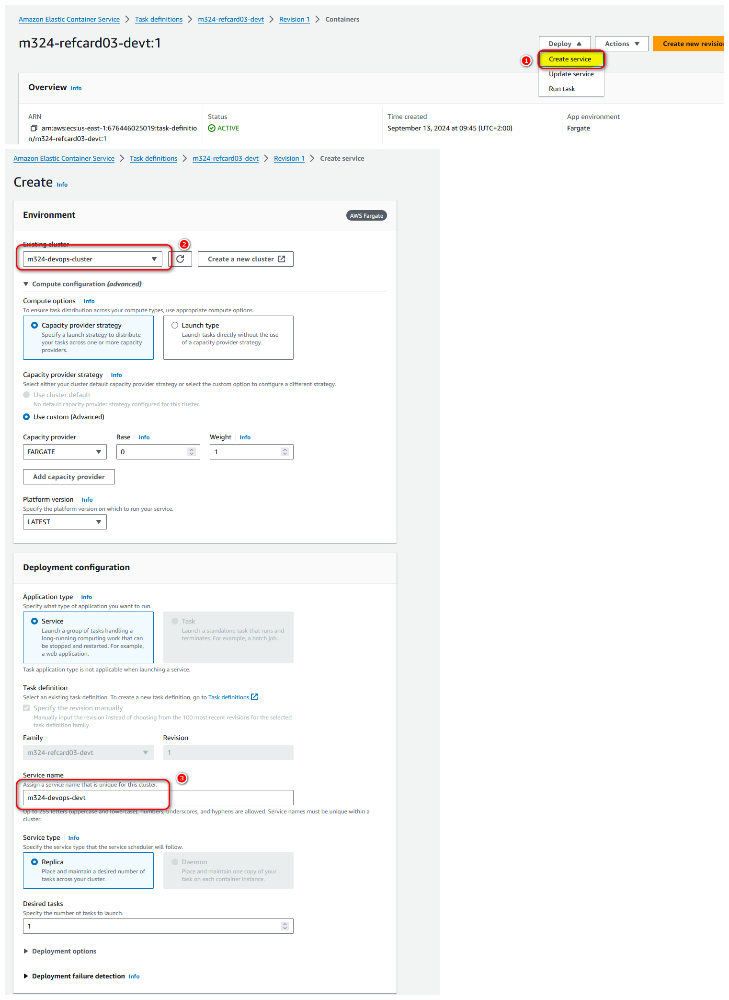

As soon as the service is running, you can do the following to make sure that the application is now working correctly.

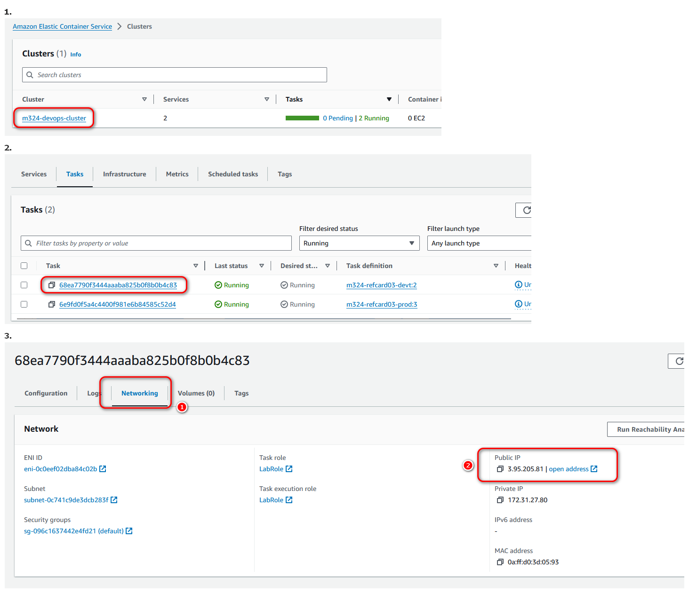

For me this was the case.

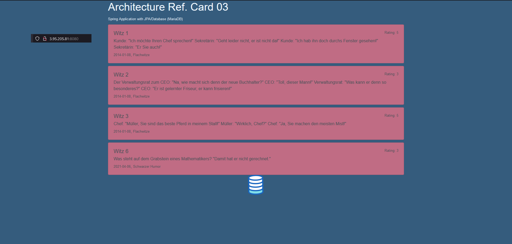

## The pipeline

### Actions

A GitHub Action Action is a reusable step that can be used in a workflow. There are many actions available in the GitHub Marketplace. In my case I created my own to setup the AWS CLI.

#### Setup ECR Action

Because the runner is a self-hosted runner, I can install the AWS CLI tool per default. This is also the case with many other [tools on the public runners](https://github.com/actions/runner-images/blob/main/images/ubuntu/Ubuntu2004-Readme.md).

So in my case, I only need to run the `aws ecr get-login-password --region us-east-1 | docker login --username AWS --password-stdin $AWS_ECR_REGISTRY` command.

### Workflows

GitHub workflows are defined in a `.github/workflows` folder. Every workflow is defined in an own `.yml` file. It contains jobs, that have steps. Each step can run multiple commands or trigger an action.

#### CI/CD workflow

In my case I created a `cicd-pipeline.yml`, where I added a basic pipeline that runs on the `develop` and `main` branch.

> [!IMPORTANT]
> TODO: Add link to pipeline

## Public runner pricing

> [!IMPORTANT]
> TODO: Pricing
